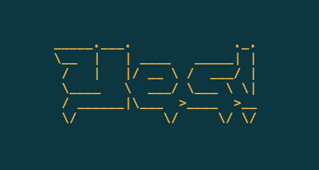

Regular Expression Utility Command
==================================

Simple utility command to create and test Go-compatible regular
expressions from the command line, stdin, or in a `regx.txt` file where
the first line is the expression and the rest of the file the test
content to be matched. When in `regx.txt` watch mode retest every 1/10th
of a second and center print a colorful `Sorry` or `Yes!` suitable for
displaying in a TMUX pane if there is a change. (You do use TMUX,
right?)

Installation
------------

```
go get -u github.com/robmuh/go-textbot/
```

Usage
-----

```
usage: regx REGX STRING
       ... | regx REGX
       regx (looks for regx.txt)
```

Sample successful `regx.txt`:

```
(?m)answ
answers = [
  "Yes.",
  "No.",
  "Maybe."
  ]
```



Sample failing `regx.txt`:

```
(?m)blah
answers = [
  "Yes.",
  "No.",
  "Maybe."
  ]
```


Motivation
----------

We use regular expressions all the time at SkilStak™ as we create
SkilBot™ challenges that examine the content and output of commands when
validating student code. This tool is also used during our regular
expression lessons and workshops and a similar version is used to assess
student regx skills.

TODO
----

Need to create a multi-line mode so every line after the first is
checked individually instead of all but the first lines being checked as
a buffer. This could be integrated into test cases specifically for
different natural language options.
